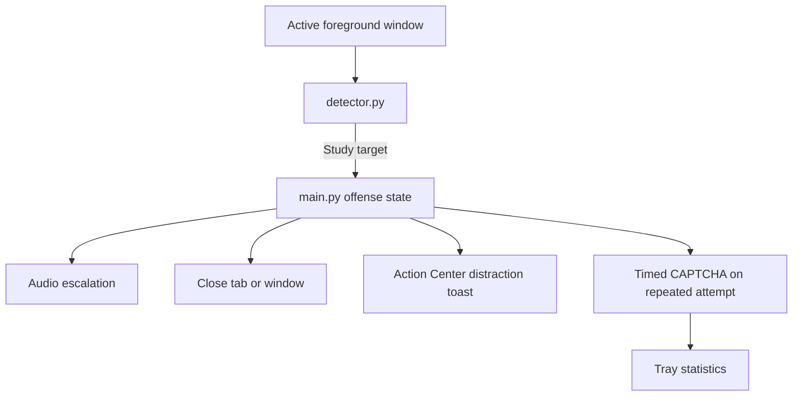

# Padikula, Padippikula 🎯

## Basic Details

### Team Name: Thengakola

### Team Members

- Team Lead: Brian Roy Mathew - ASIET
- Member 2: Ram Madhav R Kammath - ASIET

### Project Description

Padikula, Padippikula is a deliberately useless Windows daemon that detects configured study material and interferes with it. It monitors the active foreground window, identifies PDFs, academic websites, and educational YouTube channels, then escalates audio, closure actions, distraction notifications, and timed CAPTCHAs.

### The Problem (that doesn't exist)

People keep opening study material when they could be watching reels, playing games, or doing literally anything less productive. This project solves the imaginary crisis of accidental academic progress.

### The Solution (that nobody asked for)

Padikula, Padippikula declares war on studying. It detects a study attempt, closes the active tab or window, plays an increasingly dramatic audio track, sends a distraction toast with an action button, and eventually traps the user in an absurd image CAPTCHA.

## Technical Details

### Technologies/Components Used

For Software:

- Python 3.10+
- Tkinter
- `pywin32`
- `psutil`
- `pygame`
- `PyAutoGUI`
- `winotify`
- `pystray` and Pillow
- PyInstaller
- PowerShell

For Hardware:

- Windows 10/11 x64 computer
- Keyboard and mouse
- Audio output device

### Implementation

The project is divided into focused modules:

```text
Foreground window
        │
        ▼
   detector.py
        │
        ▼
     main.py
   ┌────┼─────┬──────┐
   ▼    ▼     ▼      ▼
 audio actions captcha tray
```

## Installation

```powershell
py -3.10 -m venv .venv
.\.venv\Scripts\Activate.ps1
python -m pip install --upgrade pip
pip install -r requirements.txt
```

## Run

```powershell
.\.venv\Scripts\Activate.ps1
python main.py --verbose
```

The daemon continues polling until `Ctrl+C`, the tray Exit command, or Task Manager termination.

Safe checks:

```powershell
python main.py --self-test
python actions.py --self-test
python audio.py --self-test
python verify_bundle.py
```

To build the executable:

```powershell
.\build.ps1
.\dist\Padikula_Padippikula.exe --self-test
```

### Project Documentation

#### Configuration

Edit the JSON files in `config/`:

- `websites.json`: study-related domains or title fragments.
- `youtube_channels.json`: educational channel title fragments.
- `distractions.json`: toast action labels and URLs.
- `captcha.json`: rotating CAPTCHA images, answers, prompts, and time limits.

Add MP3 files to `assets/audio/` and CAPTCHA PNG files to `assets/captcha/`.

#### Screenshots

Screenshots will be added after the final demo capture:


*Windows Action Center distraction notification with a configurable action button.*


*Timed image CAPTCHA shown after a repeated study attempt.*


*System-tray statistics screen showing blocked attempts and offense state.*

#### Diagrams



#### Schematic & Circuit

Not applicable. This is a Windows software project with no custom electronic circuit.

#### Build Photos

Not applicable. The project has no hardware build.

### Project Demo

#### Video

Demo video link will be added after recording the final flow.

The demo will show study detection, first-strike audio and notification, repeated-attempt CAPTCHA escalation, and the tray statistics screen.

#### Additional Demos

See [TEST_PLAN.md](TEST_PLAN.md) for the complete manual test procedure and expected output.

## Team Contributions

- Brian Roy Mathew: project architecture, Windows integration, daemon orchestration, packaging, and documentation.
- Ram Madhav R Kammath: configuration, assets, testing, and demo preparation.

## Safety and Limitations

- Browser tab closure depends on focus and simulated keyboard input.
- `WM_CLOSE` is a graceful request and may be ignored by an application.
- Notifications depend on Windows Action Center being available.
- The project does not disable Task Manager or make itself unkillable.
- Generated `build/`, `dist/`, virtual-environment, and Python-cache files are ignored by Git.

Built for TinkerHub Useless Projects.
